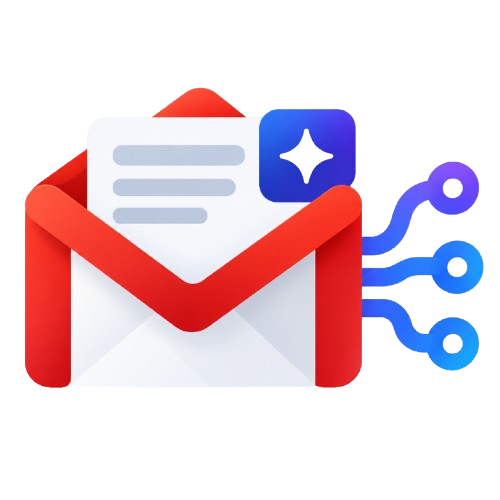

<p align="center">
  
  
</p>

<p align="center">
  
</p>

# gmail-mcp-server

A self-hosted [MCP](https://modelcontextprotocol.io) server for Gmail, built on the official
Gmail API. No third-party relay, no data leaving your own infrastructure, your Google OAuth
token and email data stay on whatever machine you run this on.

Works with any MCP-compatible client: [Claude Code](https://claude.com/claude-code) over local
stdio, or a hosted client like ChatGPT's custom connectors over HTTP with a built-in OAuth 2.1
authorization server.

## Why

Most "Gmail for AI" integrations are either a paid SaaS connector or require handing a third
party your inbox. This is neither: it's a small server you run yourself, talking directly to
Google's API with your own OAuth client.

## Tools

| Tool | Description |
|---|---|
| `gmail_search` | Search messages with Gmail's query syntax (`from:`, `is:unread`, `after:`, ...) |
| `gmail_get_message` | Fetch one message in full: headers, plain-text and HTML body, attachment metadata |
| `gmail_get_thread` | Fetch every message in a thread |
| `gmail_create_draft` | Create a draft (optionally as a threaded reply). Never sends anything |
| `gmail_list_labels` | List labels, with per-label message/thread counts |

Every response includes `to`/`cc`/`bcc`, `labelIds`, and (for `get_message`/`get_thread`)
attachment filenames and sizes. This server requests `gmail.readonly` and `gmail.compose`,
enough to read mail and create drafts, and never anything more: there is no send, modify, or
delete tool, and it never returns the contents of `credentials.json` or any token through a
tool. `gmail_create_draft` only ever leaves a draft sitting in Drafts, a human has to open Gmail
and hit send themselves.

## Quickstart: local use with Claude Code

Requirements: Python 3.10+, a Google Cloud project with the Gmail API enabled.

```bash
git clone https://github.com/Arshdeep54/gmail-mcp-server.git
cd gmail-mcp-server
python -m venv .venv && source .venv/bin/activate
pip install -e .
```

1. In the [Google Cloud Console](https://console.cloud.google.com/), enable the **Gmail API**,
   then go to **APIs & Services → Credentials → Create Credentials → OAuth client ID**, choose
   **Desktop app**, and download the JSON as `secrets/credentials.json`.
2. Add yourself as a test user under **OAuth consent screen → Test users** if the app is in
   Testing mode.
3. Authorize once:

   ```bash
   python authorize.py
   ```

   This opens a browser, and writes `secrets/token.json`.
4. Add it to Claude Code's MCP config:

   ```json
   {
     "mcpServers": {
       "gmail": {
         "command": "python",
         "args": ["-m", "gmail_mcp.server"],
         "cwd": "/path/to/gmail-mcp-server"
       }
     }
   }
   ```

That's it for local, stdio-based use, no auth server, no network exposure.

## Deploying for a hosted client (e.g. ChatGPT connectors)

Hosted MCP clients need a real HTTPS endpoint and typically support only **None** or **OAuth**
authentication, not a plain bearer header. This project ships a minimal OAuth 2.1 authorization
server for exactly that case: a standard authorization-code + PKCE flow, gated by a single
consent screen that asks for a passphrase you set yourself, so a token is only ever issued after
you personally approve it.

**Full deployment instructions:** see [DEPLOYMENT.md](DEPLOYMENT.md).

Quick steps:
1. Set up a reverse proxy (Caddy or Nginx) with HTTPS
2. Copy `.env.example` to `.env` and fill it in
3. Run `python authorize.py` once to generate `secrets/token.json`
4. `docker compose up -d --build`
5. In your MCP client, add a custom connector with your domain

Access tokens are short-lived (1 hour) with long-lived refresh tokens, both persisted to
`secrets/oauth_state.json` so a container restart doesn't force re-authorization.

## Security notes

- Only `gmail.readonly` and `gmail.compose` are ever requested, nothing broader.
- `credentials.json`, `token.json`, `.env`, and `secrets/` are git-ignored, never commit them.
- The OAuth flow's consent step requires a passphrase only you know, so a leaked connector URL
  alone can't silently mint a token.
- DNS-rebinding protection (`GMAIL_MCP_ALLOWED_HOSTS`) locks the server to the hostname(s) you
  configure.
- There is no `send`, `modify`, or `delete` tool, by construction: the only write path is
  `gmail_create_draft`, and a draft is inert until a human opens it in Gmail and sends it.
- This is single-tenant: it authenticates as one Gmail account (yours), not a per-user login.
  Anyone who reaches your deployed instance and gets past the consent passphrase reads and
  drafts as *you*, not as themselves, don't share the deployed URL and passphrase together.

See [DEPLOYMENT.md](DEPLOYMENT.md) for production hardening recommendations.

## Project layout

```
gmail_mcp/
  auth.py            Google OAuth (installed-app flow) for the Gmail API itself
  gmail_client.py     Thin wrapper around the Gmail API for the four tools
  server.py           MCP tool definitions
  http_app.py          HTTP transport entrypoint (used for Docker/hosted deployments)
  oauth_provider.py   Minimal OAuth 2.1 authorization server (auth code + PKCE + refresh)
  consent.py           The passphrase-gated consent page
authorize.py           One-time local script to obtain secrets/token.json
```

## Documentation

Full docs: **[gmail-mcp.hiesenbug.dev](https://gmail-mcp.hiesenbug.dev)**

- [DEPLOYMENT.md](DEPLOYMENT.md) — Full guide to deploying on EC2, DigitalOcean, etc. with HTTPS and ChatGPT integration
- [TROUBLESHOOTING.md](TROUBLESHOOTING.md) — Common errors and solutions (OAuth failures, token issues, etc.)

## Author

Built by [Arshdeep54](https://github.com/Arshdeep54)

## License

MIT, see [LICENSE](LICENSE).
